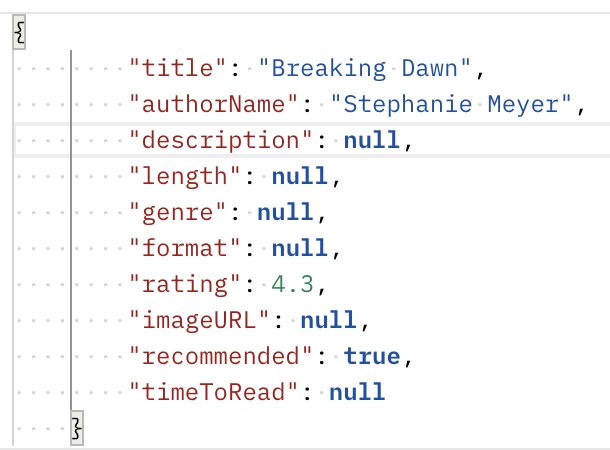

# EventTrackerProject

--

## About Event Tracker
The Event Tracker is a simple REST API starter project. It is the foundation for what will be, the Book Nook Application. Book Nook will be a full-scale web application and will rely on the foundation for CRUD operations that are found within this event tracker project.  

## How It Works
This program was developed in Spring Tools Suite and tested using Postman. It's functionality includes the option to search for a full list of books using a GET mapping of: (http://localhost:8086/api/books). The search funciton can also be narrowed according to books by author name, description, title, and book id. The id search uses a GET mapping of http://localhost:8086/api/books/{id}, and the others are found using http://localhost:8086/api/books/search/{keyword}. To provide full CRUD operations, there are also options to add a new book, delete an existing book(by id), and update a book(by id). To add a book the POST mapping is http://localhost:8086/api/books. To delete, a DELETE mapping of http://localhost:8086/api/books/{id}. And finally, to update, a PUT mapping of http://localhost:8086/api/books/{id}. Please see the photo below for an example of the JSON input that can be used for creation and updateThese operations are all facilitated through Postman now, but will be added to the front end of the application.

## Technologies Used

-  Java
-  MySQL Workbench
-  SpringBoot
-  Atom
-  GitHub
-  MySQL
-  Tomcat 8
-  MAMP
-  Google
-  Spring Tool Suite 4
-  Gradle
-  Object-Oriented Programming
-  Test Driven Development using Postman
